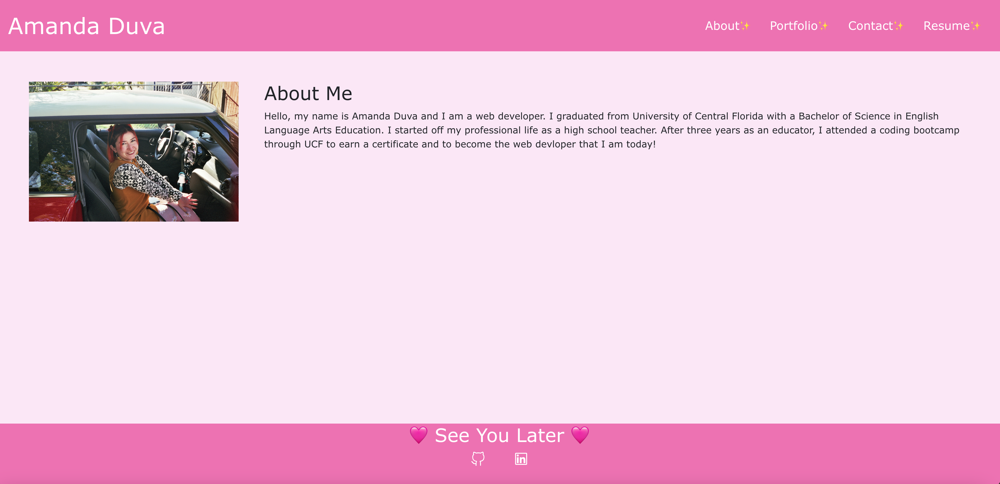

# portfolio
A portfolio of my projects using React.

## Usage and Installation

To use this project, you can clone the repository onto your machine. Be sure to run `npm install` before running `npm start`. 

If you wish to view the deployed application, please click on the link below. You may navigate through the page using the navigation bar in the top right. One the Resume tab, please toggle by clicking on the resume link. Click on the link again to view my proficiencies once more. 

Link to the [deployed application](https://amandajduva.github.io/portfolio/portfolio). 

Screenshot of deployed application:

## Credits

While I wrote the code for this application, I received support from a tutor. 

## License

Please refer to the LICENSE in the repo.